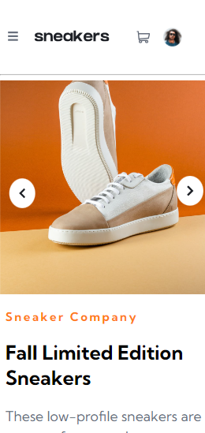
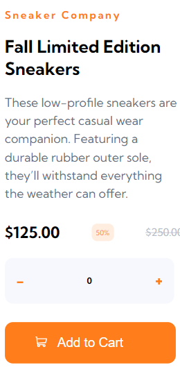
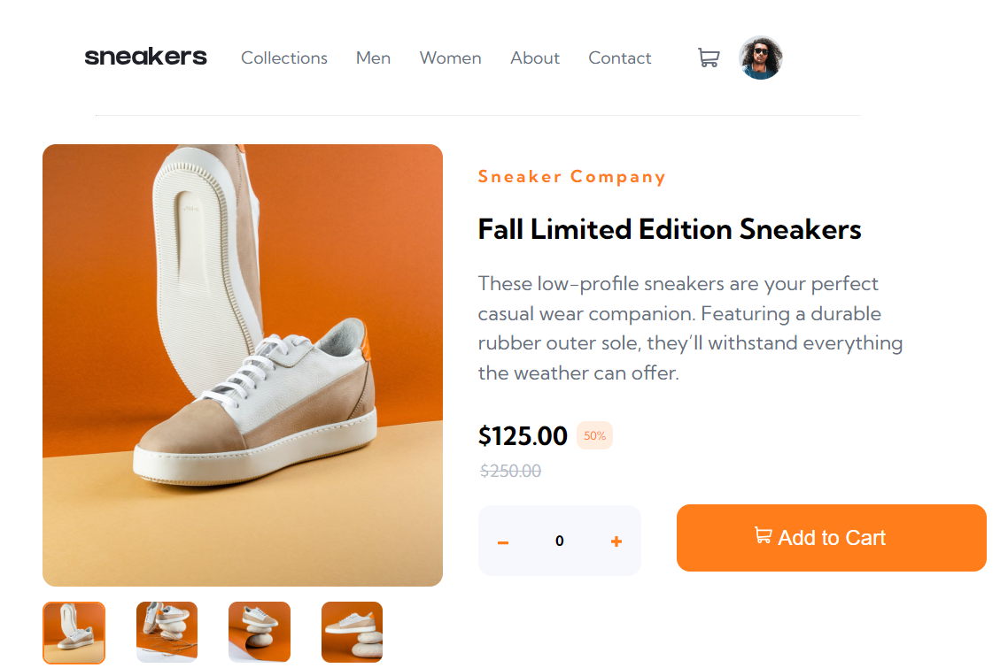

# Frontend Mentor - E-commerce product page solution

This is a solution to the [E-commerce product page challenge on Frontend Mentor](https://www.frontendmentor.io/challenges/ecommerce-product-page-UPsZ9MJp6). Frontend Mentor challenges help you improve your coding skills by building realistic projects.

## Table of contents

- [Overview](#overview)
  - [The challenge](#the-challenge)
  - [Screenshot](#screenshot)
  - [Links](#links)
- [My process](#my-process)
  - [Built with](#built-with)
  - [What I learned](#what-i-learned)  
  - [Reflection](#reflection)
- [Author](#author)


## Overview

### The challenge

Users should be able to:

- View the optimal layout for the site depending on their device's screen size
- See hover states for all interactive elements on the page
- Open a lightbox gallery by clicking on the large product image
- Switch the large product image by clicking on the small thumbnail images
- Add items to the cart
- View the cart and remove items from it

### Screenshot

- # Mobile





- # Desktop



### Links

- Solution URL: [Add solution URL here](https://github.com/Dhanveeryadav/e-commerce-product-page)
- Live Site URL: [Add live site URL here](https://chimerical-genie-e86c58.netlify.app)

## My process

### Built with

- Semantic HTML5 markup
- CSS custom properties
- Flexbox
- CSS Grid
- Mobile-first workflow

### What I learned

- ## BEM

  In this project I used BEM (Block Element Modifier) a css class naming convention to structure your code and style it better.

- ## Web Accessibility

  When websites and web tools are properly designed and coded, so that people with disabilities or anyone in the world can use them. But I think you have to write a lot of html for this.

```html
<header class="header flex-container-horizontal">
  <div>
    
  </div>
  <button
    class="header__hamburger"
    aria-expanded="false"
    aria-controls="nav__list"
  >
    <span class="sr-only">Menu</span>
  </button>
  <nav class="nav flex-container-horizontal">
    <ul
      data-visibility="false"
      id="nav__list"
      class="nav__list flex-container-horizontal"
    >
      <li class="nav__list-item">
        <a class="nav__list-items-link" href="#">Collections</a>
      </li>
    </ul>
  </nav>
</header>
```

- ## html custom attribute(data-\*)
  The data-\* attribute is used to store custom data private to the page or application.

```js
hamburger.addEventListener("click", () => {
  const isVisible = navList.getAttribute("data-visibility");

  if (isVisible === "false") {
    navList.setAttribute("data-visibility", "true");
    hamburger.setAttribute("aria-expanded", "true");
  } else if (isVisible === "true") {
    navList.setAttribute("data-visibility", "false");
    hamburger.setAttribute("aria-expanded", "false");
  }
});
```

### Reflection

- There are topics which I am learning right now means not completely comfortable with them like BEM and web-accessibility and decided to use them in this project which tells me I still need to practise them.

  with BEM the project structure is coming well at first but after some point I messed up, but I still continue with it after completing the most of the part of this project I decided to take a break from it or I have to as my exams are coming, after finishing my exam I resume this project after 10 to 20 days later and I surprise how well I am able to understand my code it may be due to BEM (I think). But some people are saying it is not good for smaller project but if you have a large project it really going to shine. so for now I am going shift back to normal css naming convention the hypen one.

- For web-accessibility I would like to learn more about this because making a site accessible to everyone or most people is really cool. 

## Author

- Frontend Mentor - [@Dhanveeryadav](https://www.frontendmentor.io/profile/Dhanveeryadav)
